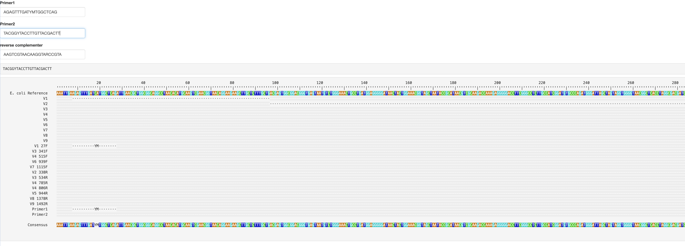

# whvr: Which HyperVariable Region

Its a shiny app to do some quick visualization about where your primers or amplicons are in the 16S gene.



## Installation
```
remotes::install_github("nickp60/whvr")
```

## Usage:
Launch the shiny app from Rstudio or deploy.


## Deployment:

1. ensure the manifest.json is up to date by running `rsconnect::writeManifest()`
2. Configure your Posit Connect to serve the app.R script from the main branch